<div align="center">

# oh-my-goal

**Codex-style `/goal` autonomy for OpenCode.**

Set one objective. Let the agent keep going until the work is done, blocked, paused, or out of budget.

[](https://github.com/flyingsquirrel0419/oh-my-goal/actions/workflows/ci.yml)
[](https://github.com/flyingsquirrel0419/oh-my-goal/actions/workflows/release.yml)
[](https://www.npmjs.com/package/oh-my-goal)
[](https://www.npmjs.com/package/oh-my-goal)
[](./LICENSE)
[](./package.json)
[](https://www.typescriptlang.org/)
[](https://prettier.io/)

[Install](#install) · [Usage](#usage) · [How It Works](#how-it-works) · [Contributing](#contributing)

</div>

---

## Demo



## Why

OpenCode already has powerful automation plugins. Many of them are built for advanced orchestration: multiple agents, metrics, scopes, model maps, verification plans.

`oh-my-goal` is intentionally smaller.

```text
/goal fix the flaky login test
```

That is the interface. The plugin stores the goal, injects a continuation prompt whenever the session goes idle, and keeps the agent moving until there is a concrete stop condition.

## Features

- **One-line autonomy**: start with `/goal <objective>`.
- **Project-local state**: stores goal state in `.opencode/goal.json`.
- **Continuation loop**: uses `session.idle` to push the agent into the next concrete action.
- **Completion detection**: watches for `GOAL_ACHIEVED:` and `GOAL_BLOCKED:` markers.
- **Budget guardrails**: tracks token usage and warns near the configured budget.
- **Compaction-safe context**: preserves goal state through OpenCode session compaction.
- **No model orchestration**: plays nicely beside other OpenCode tools because it only manages goal continuation.

## Install

```bash
npm i -g oh-my-goal
```

Add it to `opencode.json`:

```json
{
  "plugin": ["oh-my-goal"]
}
```

## Usage

Start a goal:

```text
/goal fix the login redirect bug
```

Check or control the active goal:

```text
/goal status
/goal pause
/goal resume
/goal clear
```

Override the default token budget:

```text
/goal raise payment module test coverage to 80% --token-budget 100000
```

## Commands

| Command             | Behavior                                              |
| ------------------- | ----------------------------------------------------- |
| `/goal <objective>` | Create a new goal and start the loop                  |
| `/goal status`      | Show current objective, status, budget, and iteration |
| `/goal pause`       | Pause the loop without deleting goal state            |
| `/goal resume`      | Resume a paused goal                                  |
| `/goal clear`       | Delete `.opencode/goal.json` and stop the loop        |

## How It Works

The plugin is deliberately simple:

```text
/goal <objective>
  -> write .opencode/goal.json
  -> on session.idle, inject continuation prompt
  -> on message.updated, scan for stop markers and token usage
  -> preserve goal context during compaction
```

When a goal is `pursuing`, each idle event injects an active-goal check into the session. The agent must concretely decide whether the original objective is complete. If not, it continues immediately.

The loop stops when:

- The assistant emits `GOAL_ACHIEVED: <summary>`
- The assistant emits `GOAL_BLOCKED: <reason>`
- `/goal pause` or `/goal clear` is used
- The token budget or iteration limit is reached

## State File

`.opencode/goal.json` follows this shape:

```json
{
  "objective": "fix the login redirect bug",
  "status": "pursuing",
  "created_at": "2026-05-05T10:00:00.000Z",
  "updated_at": "2026-05-05T10:02:00.000Z",
  "token_budget": 50000,
  "tokens_used": 12400,
  "iteration": 3,
  "max_iterations": 100,
  "budget_warning_sent": false,
  "history": [
    {
      "iteration": 1,
      "summary": "Injected continuation prompt.",
      "status": "in_progress",
      "created_at": "2026-05-05T10:01:00.000Z"
    }
  ]
}
```

## Development

```bash
npm ci
npm run check
npm run build
```

Quality gates:

- `npm run typecheck`
- `npm run lint`
- `npm run format:check`
- `npm audit --omit=dev`

## Contributing

Issues and pull requests are welcome. See [CONTRIBUTING.md](./CONTRIBUTING.md), [CODE_OF_CONDUCT.md](./CODE_OF_CONDUCT.md), and [SECURITY.md](./SECURITY.md).

## License

Apache-2.0. See [LICENSE](./LICENSE).
